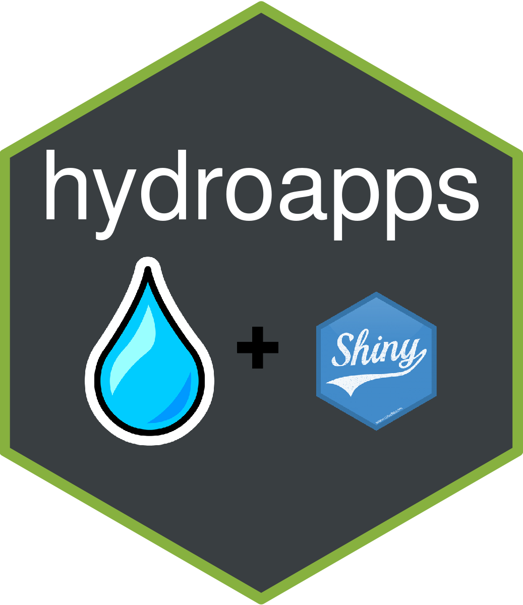

<!-- README.md is generated from README.Rmd. Please edit that file -->

# wildlandhydRo <a></a>

# hydroapps

<!-- badges: start -->

[](https://lifecycle.r-lib.org/articles/stages.html#experimental)
<!-- badges: end -->

The goal of {hydroapps} is to to create apps for resource management in
the context of hydrology monitoring and reporting. This package relies
heavily on [USGS API](https://www.usgs.gov/products/data-and-tools/apis)
and [NRCS API](https://wcc.sc.egov.usda.gov/reportGenerator/) wouldn’t
be possible with out it (much thanks). However, this package is highly
experimental and is used mostly by myself but I think it’s worth
sharing! Please enjoy and contributions are welcome!

## Goals

As of **11/29/2021** the app is functional on Windows 10 OS. Things to
work on:

-   Looking at adding NLDI and NWS apps.

-   water year and year confusion was solved by just defaulting to water
    year (10/1-9/30). If someone wants options please add to issues or
    PR.

-   reduce package dependencies. Looking to get {wildlandhydRo} on CRAN
    and then might be able to drop some dependencies and look to get
    this on CRAN…

-   Any ideas? Please let me know!

## Installation

This is only in development right now.

And the development version from [GitHub](https://github.com/) with:

``` r
# install.packages("devtools")
devtools::install_github("joshualerickson/hydroapps")
```

## Contributions

This package uses the [golem](https://github.com/ThinkR-open/golem)
framework and thus uses modules to bring everything together. If you
want to help contribute please be aware of this framework, i.e. see
[here](https://engineering-shiny.org/golem.html) for more details. Other
than that, contributions are welcomed!

## Basic Example

As of right now there are three running apps (streamstats, usgs\_stats,
snotel\_stats). Just run the following code below and a shiny app will
pop-up. If the site has invalid data or is not functioning then the app
will not complete.

``` r
#interact with the StreamStats API
run_app('streamstats')

#get USGS gauging station stats
run_app('usgs_stats')

#get snotel station stats
run_app('streamstats')
```

In addition, you can run a couple of functions to just get the reports
for USGS and SNOTEL stations.

``` r
get_snotel_report(site = '787')

get_usgs_report(site = '12301250')
```
